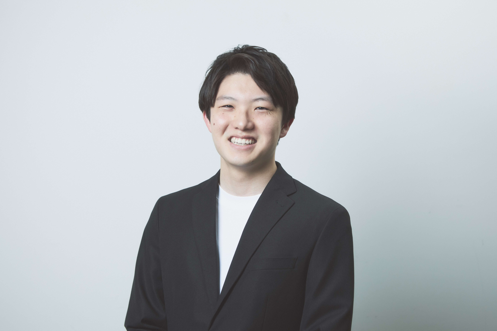

# 自己紹介（堀圭佑）

 

 

[ジーフィット株式会社](https://gfit.co.jp) データサイエンティスト（2023年4月より現職）。

「ディープラーニング x 為替」の分野にて、貿易企業の為替リスクをコントロールする基礎研究とビジネスを推進中です。

 

## 職歴

- 2023 年 4 月 より: ジーフィット株式会社 データサイエンティスト

 

## 学歴

- 2014 年 4 月 - 2017 年 3 月: 埼玉県立大宮高等学校 普通科 卒業
- 2017 年 4 月 - 2021 年 3 月: 千葉大学工学部 医工学コース 卒業
- 2021 年 4 月 - 2023 年 3 月: 東京大学大学院 工学系研究科 修士課程 修了

 

## 修士研究

 

頻脈不整脈に対する効果的な焼灼治療戦略の検討に向けた

- 位相勾配の発散を用いた湧き出し興奮波の定量的検出手法の開発
- 深層学習を用いた疎な電極信号に基づく三次元膜電位分布推移手法の開発

について研究を行ってきました。

 

## 研究業績

 

### 学会発表

- 堀圭佑, 岩男悠真, 高橋美和子, 椎谷洋彦, 佐藤雅昭, 山谷泰賀: 肺移植後FDG-PET ～ Deep Learningによる拒絶反応予測と判断根拠の可視化 ～, 電子情報通信学会技術研究報告 信学技報, 3月, 2021.（口頭発表）

- 堀圭佑, 瀬野宏, 富井直輝, 山崎正俊, 佐久間一郎: 効果的なアブレーション治療に向けた細動中の湧き出し興奮波の定量的検出手法の開発, 日本生体医工学会関東支部　若手研究者発表会2021, 11月, 2021.（口頭発表）

 

### 代表論文

- Hori, K., Seno, H., Sakuma, I. et al. Phase Gradient Divergence for the Quantitative Detection of Focal Activation Events During Cardiac Fibrillation. J. Med. Biol. Eng. 43, 427–436 (2023). https://doi.org/10.1007/s40846-023-00804-0

 

### 受賞歴

- 優秀論文賞, Deeplearningを⽤いたFDG-PETによる肺移植拒絶反応予測とその判断根拠の可視化, 千葉大学工学部医工学コース, 2017年3月

 

### 特許

- Sakuma, I., Tomii, N., & Hori, K. (外国), Detection algorithm of breakthrough excitation among cardiac fibrillation (特許番号P211071US00), The University of Tokyo